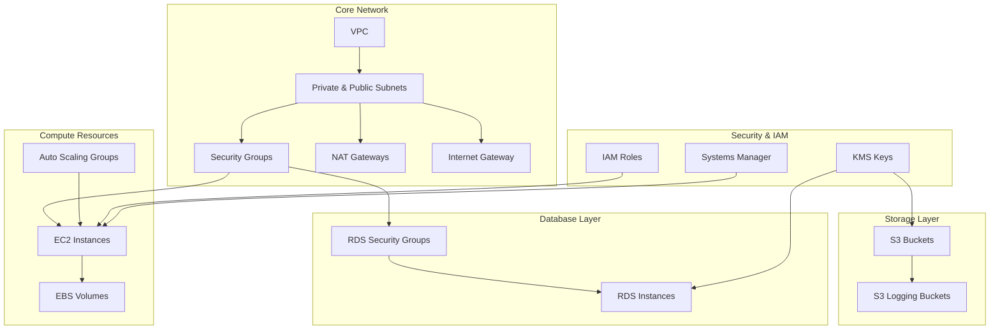

# Terragrunt Catherine - AWS Infrastructure

This repository contains a modular AWS infrastructure deployment using Terragrunt for better code organization and reusability. The infrastructure is designed following AWS best practices for security, scalability, and maintainability.

## 🎯 Key Features

- **Modular Infrastructure**: Components are organized into reusable modules
- **Infrastructure as Code**: Version-controlled using Terragrunt and Terraform
- **Security First**: Built-in security controls and encryption
- **High Availability**: Resources deployed across multiple availability zones
- **Cost Optimization**: Resource sizing based on requirements
- **Automated Management**: Infrastructure lifecycle automation
- **Compliance Ready**: Follows AWS security best practices

## Requirements

| Name | Version |
|------|---------|
| terraform | = 1.13.0 |
| terragrunt | = 0.84.0 |
| aws | = 6.2.0 |
| azure | = 4.38.1 |

## Providers

| Name | Version |
|------|---------|
| aws | = 6.2.0 |
| azure | = 4.38.1 |

## 🗺️ Resource Map

### Core Infrastructure Resources

| Resource Type | Description | Module Path | Managed By |
|--------------|-------------|-------------|------------|
| VPC | Main VPC in eu-west-1 | `network/vpc` | Terragrunt |
| Public Subnets | For internet-facing resources | `network/vpc` | Terragrunt |
| Private Subnets | For internal resources | `network/vpc` | Terragrunt |
| Security Groups | Network access control | `network/security_groups` | Terragrunt |
| NAT Gateways | For private subnet internet access | `network/vpc` | Terragrunt |
| Internet Gateway | For public internet access | `network/vpc` | Terragrunt |

### Compute & Storage Resources

| Resource Type | Description | Module Path | Managed By |
|--------------|-------------|-------------|------------|
| EC2 Instances | Application servers | `compute/ec2` | Terragrunt |
| Auto Scaling Groups | EC2 scaling management | `compute/ec2` | Terragrunt |
| EBS Volumes | EC2 storage | `compute/ec2` | Terragrunt |
| S3 Buckets | Object storage | `storage/s3` | Terragrunt |
| RDS Instances | PostgreSQL databases | `database/rds` | Terragrunt |

### Security & IAM Resources

| Resource Type | Description | Module Path | Managed By |
|--------------|-------------|-------------|------------|
| IAM Roles | Service roles | `security/iam` | Terragrunt |
| KMS Keys | Encryption keys | `security/kms` | Terragrunt |
| Systems Manager | Instance management | `compute/ec2` | Terragrunt |

### Architectural Diagram



## 📊 Resource Configuration Matrix

### Network Configuration

| Component | eu-west-1 |
|-----------|-----------|
| VPC CIDR | 10.0.0.0/16 |
| Public Subnets | 10.0.1.0/24, 10.0.2.0/24 |
| Private Subnets | 10.0.101.0/24, 10.0.102.0/24 |
| NAT Gateways | One per AZ |
| VPC Flow Logs | Enabled |

### Compute Resources

| Component | Specification |
|-----------|--------------|
| EC2 Instance Types | t3.micro - t3.large |
| Auto Scaling | Min: 2, Max: 6 |
| EBS Volume Types | gp3 |
| EBS Volume Size | 50GB |

### Database Configuration

| Component | Specification |
|-----------|--------------|
| Engine | PostgreSQL |
| Instance Class | db.t3.medium |
| Storage | 100GB gp3 |
| Multi-AZ | Yes |
| Backup Retention | 7 days |

### Security Features

| Component | Configuration |
|-----------|--------------|
| Security Groups | Least privilege access |
| KMS Encryption | All resources |
| IAM Roles | Service-specific |
| SSL/TLS | Required |

## � Getting Started

### Prerequisites

- Terraform = 1.13.0
- Terragrunt = 0.84.0
- AWS Provider = 6.2.0
- Azure Provider = 4.38.1
- AWS CLI configured with appropriate credentials

### Initial Setup

1. Clone the repository:
```bash
git clone https://github.com/catherinevee/terragrunt-catherine.git
cd terragrunt-catherine
```

2. Initialize and apply the infrastructure:
```bash
cd eu-west-1
terragrunt run-all init
terragrunt run-all plan
terragrunt run-all apply
```

## 🔐 Security Best Practices

- All data encrypted at rest using KMS
- Network security groups with minimal access
- IAM roles following principle of least privilege
- VPC Flow Logs enabled for network monitoring
- Regular security patches and updates
- Secure access via Systems Manager

## 🔄 Maintenance

- Regular infrastructure updates
- Automated backups and snapshots
- Performance monitoring via CloudWatch
- Cost optimization reviews
- Security compliance checks

## �📁 Directory Structure

```
terragrunt-catherine/
├── README.md                     # Project documentation
├── eu-west-1/                   # Primary region resources
│   ├── region.hcl               # Region-specific variables
│   ├── root.hcl                 # Root configuration
│   ├── _envcommon/             # Common configurations
│   ├── compute/
│   │   └── ec2/                # EC2 instances with auto-scaling
│   ├── database/
│   │   └── rds/                # RDS PostgreSQL instances
│   ├── network/
│   │   ├── vpc/                # VPC and subnet configurations
│   │   └── security_groups/    # Network security rules
│   ├── security/
│   │   └── iam/                # IAM roles and policies
│   └── storage/
│       └── s3/                 # S3 buckets with versioning
```

## 🔒 Security Controls

### Network Security
- VPC flow logs enabled
- Private subnets for sensitive resources
- Security groups with minimal required access
- NAT gateways for private subnet internet access

### Data Security
- Encryption at rest using KMS
- Encryption in transit required
- S3 bucket versioning enabled
- Regular RDS snapshots

### Access Control
- IAM roles with least privilege
- Service-linked roles where applicable
- No direct SSH access to instances
- Systems Manager for instance management

## 🔄 Resource Dependencies

1. **VPC & Network**
   - VPC must be created first
   - Security Groups depend on VPC
   - NAT Gateways require public subnets

2. **Compute Layer**
   - EC2 instances require VPC and Security Groups
   - Auto Scaling Groups depend on Launch Templates
   - EBS volumes attached to EC2 instances

3. **Database Layer**
   - RDS requires private subnets
   - Security Groups must be configured
   - KMS keys must exist for encryption

4. **Storage Layer**
   - S3 buckets require KMS keys
   - Logging buckets must exist first

## Inputs

| Name | Description | Type | Default | Required |
|------|-------------|------|---------|:--------:|
| environment | Environment (dev, staging, prod) | `string` | `"dev"` | yes |
| aws_region | AWS region to deploy into | `string` | `"eu-west-1"` | yes |
| vpc_cidr | CIDR block for VPC | `string` | `"10.0.0.0/16"` | yes |
| enable_vpc_flow_logs | Enable VPC flow logs | `bool` | `true` | no |
| instance_type | EC2 instance type | `string` | `"t3.micro"` | no |
| rds_instance_class | RDS instance class | `string` | `"db.t3.medium"` | no |

## Outputs

| Name | Description |
|------|-------------|
| vpc_id | ID of the created VPC |
| private_subnet_ids | List of IDs of private subnets |
| public_subnet_ids | List of IDs of public subnets |
| rds_endpoint | Endpoint for RDS instance |
| ec2_instance_ips | List of EC2 instance private IPs |

## Examples

### Basic Usage

```hcl
# Example of deploying basic infrastructure
include {
  path = find_in_parent_folders()
}

inputs = {
  environment = "dev"
  vpc_cidr = "10.0.0.0/16"
  enable_vpc_flow_logs = true
  instance_type = "t3.micro"
}
```

### Production Configuration

```hcl
# Example of production environment setup
include {
  path = find_in_parent_folders()
}

inputs = {
  environment = "prod"
  vpc_cidr = "10.1.0.0/16"
  enable_vpc_flow_logs = true
  instance_type = "t3.large"
  rds_instance_class = "db.t3.large"
}
```

## 🚀 Deployment Strategy

1. **Infrastructure Order**
   ```bash
   # 1. Network Layer
   cd network/vpc
   terragrunt apply
   
   # 2. Security Groups
   cd ../security_groups
   terragrunt apply
   
   # 3. Database Layer
   cd ../../database/rds
   terragrunt apply
   
   # 4. Compute Layer
   cd ../../compute/ec2
   terragrunt apply
   ```

2. **Validation Steps**
   - Verify VPC and subnet creation
   - Confirm security group rules
   - Test database connectivity
   - Validate EC2 instance access

## Contributing

1. Fork the repository
2. Create a feature branch
3. Commit your changes
4. Push to the branch
5. Create a Pull Request

## License

This project is licensed under the MIT License - see the [LICENSE](LICENSE) file for details.

## Authors

* **Catherine** - *Initial work* - [catherinevee](https://github.com/catherinevee)
